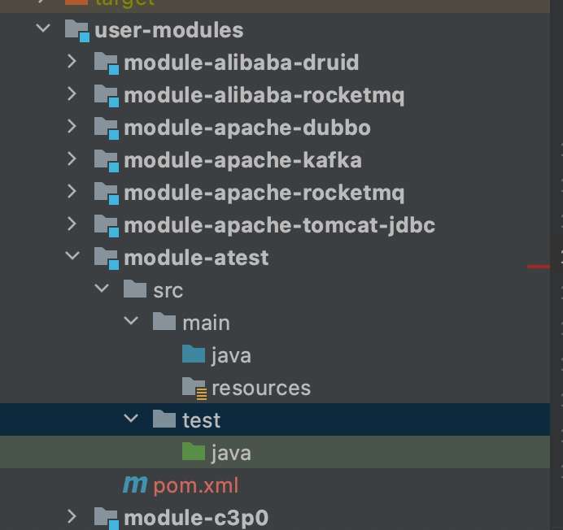
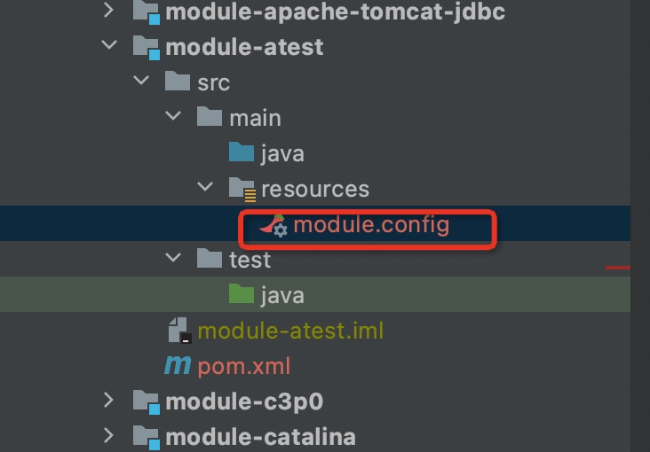
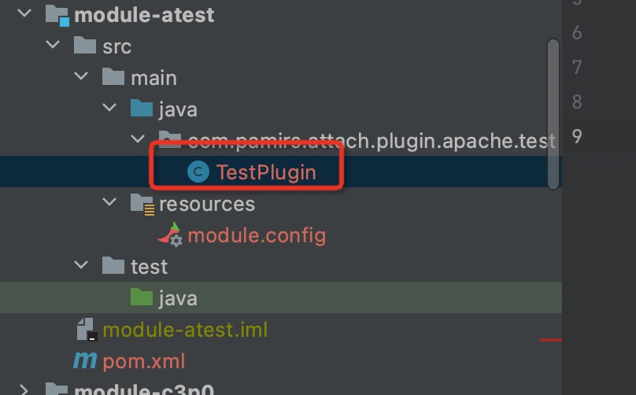

# 插件开发宝典

### 1.在user-modules增加对应的maven子模块



### 2.修改插件的pom.xml文件

1.在`properties`中添加`module-name`:

```
<properties>
    <module-name>aerospike</module-name>
</properties>
```
2.添加如下依赖

```aidl
<dependency>
    <groupId>com.shulie.instrument.simulator</groupId>
    <artifactId>instrument-simulator-api</artifactId>
    <!--需要确认版本号是否是最新的-->
    <version>1.0.1</version>
    <scope>provided</scope>
</dependency>
<dependency>
    <groupId>com.shulie.instrument.simulator</groupId>
    <artifactId>instrument-simulator-base-api</artifactId>
    <!--需要确认版本号是否是最新的-->
    <version>1.0.1</version>
    <scope>provided</scope>
</dependency>
<dependency>
    <groupId>com.shulie.instrument.simulator</groupId>
    <artifactId>instrument-simulator-messager</artifactId>
    <!--需要确认版本号是否是最新的-->
    <version>1.0.1</version>
    <scope>provided</scope>
</dependency>
<dependency>
    <groupId>org.kohsuke.metainf-services</groupId>
    <artifactId>metainf-services</artifactId>
    <version>1.7</version>
    <scope>compile</scope>
</dependency>
<dependency>
    <groupId>com.shulie.instrument.module</groupId>
    <artifactId>simulator-internal-bootstrap-api</artifactId>
    <version>1.0.0</version>
    <!--需要确认版本号是否是最新的-->
    <scope>provided</scope>
</dependency>
<dependency>
    <groupId>com.shulie.instrument.module</groupId>
    <artifactId>simulator-bootstrap-api</artifactId>
    <version>1.0.0</version>
    <!--需要确认版本号是否是最新的-->
    <scope>provided</scope>
</dependency>
<dependency>
    <groupId>com.shulie.instrument.module</groupId>
    <artifactId>module-pradar-core</artifactId>
    <!--需要确认版本号是否是最新的-->
    <version>1.0.0</version>
    <scope>provided</scope>
</dependency>
```

### 3.添加module.config文件

在 resources 目录下增加一个名为 module.config 的 properties 文件



内容如下：

```aidl
#模块名称，与上面的模块名称保持相同
module-id=aerospike
#导出的 class 名称全路径,没有则不需要，多个以逗号分隔
#export-class=
#导入的 class 名称全路径,没有则不需要，多个以逗号分隔，如果依赖了其他模块中的类则不仅仅是将其他模块的依赖加入到
#pom 文件，并且需要在配置文件中导入对应的类，并且需要保证依赖的模块已经被加载，可以参考 switch-control
#import-class=
#导出的包名称，多个以逗号分隔，支持匹配，如 com.pamirs.*则导出所有 com.pamirs 下面所有的类
#export-package=
#导入的包名称,多个以逗号分隔，支持匹配，如 com.pamirs.*则导入所有 com.pamirs 下面所有的类
import-package=com.pamirs.pradar.*
#导出的资源列表，多个以逗号分隔
#export-resource=
#导入的资源列表，多个以逗号分隔
#import-resource=
# define a switcher to management module load. call GlobalSwitch to change switcher status,
# it will trigger module loading if switcher is on, multi switcher split with comma
#依赖的开关名称，多个以逗号分隔，如果直接依赖某个模块则直接写对应的模块名称即可，则在依赖的模块激活时则将启动
#当前模块的加载，如果需要自定义依赖开关如需要等待依赖模块中的某个逻辑执行完或者执行正确才能加载当前模块则可以自
#定义开关名称，在依赖模块中执行完逻辑后调用 GlobalSwitch.switchOn()或者 GlobalSwitch.switchOff 来实现
#手动开关
switch-control=clusterTestSwitcher

#当前模块支持的 simulator 框架版本号，支持版本号范围，当当前运行的框架版本号不在模块的支持之列，则会打印对应的模块
#版本不支持,格式为  开始版本号-结束版本号,如果开始版本号不写则默认是最小版本号开始，如果结束版本号不写则默认到最大版本号
simulator-version=1.0.0-
```

所有以上的导入、导出，在导入时需要确认依赖的模块是否已经导出了对应的类、包或者是资源，否则会找不到对应的类、包、资源

### 4.编码

1.增加 ExtensionModule 的 class 声明



```aidl
import com.pamirs.pradar.interceptor.Interceptors;
import com.shulie.instrument.simulator.api.ExtensionModule;
import com.shulie.instrument.simulator.api.ModuleInfo;
import com.shulie.instrument.simulator.api.ModuleLifecycleAdapter;
import com.shulie.instrument.simulator.api.instrument.EnhanceCallback;
import com.shulie.instrument.simulator.api.instrument.InstrumentClass;
import com.shulie.instrument.simulator.api.instrument.InstrumentMethod;
import com.shulie.instrument.simulator.api.listener.Listeners;
import com.shulie.instrument.simulator.api.resource.ReleaseResource;
import com.shulie.instrument.simulator.api.scope.ExecutionPolicy;
import org.kohsuke.MetaInfServices;

@MetaInfServices(ExtensionModule.class)
@ModuleInfo(id = "test", version = "1.0.0", author = "test@shulie.io",description = "这只是一个测试插件")
public class TestPlugin extends ModuleLifecycleAdapter implements ExtensionModule {
    @Override
    public void onActive() throws Throwable {
        //增强的目标 class 是xxxx.xxxx.Test
        enhanceTemplate.enhance(this, "xxxx.xxxx.Test", new EnhanceCallback() {
            //参数为匹配的 增强Class 对象
            @Override
            public void doEnhance(InstrumentClass target) {
                //对目标方法进行增强,参数列表为 java.lang.String, int
                //即方法的声明为 test(String xxx,int xxx),因为方法名称和方法参数就可以唯一定位一个方法了
                final InstrumentMethod method = target.getDeclaredMethod("test", "java.lang.String", "int");
                method.addInterceptor(Listeners.of(TestInterceptor.class)); //使用的拦截器为无参拦截器，并且是可以在一次调用中反复执行的
                
                
                //如果拦截器是需要传递参数，则添加参数
                method.addInterceptor(Listeners.of(TestInterceptor.class, 参数1...参数 N));
                
                //如果拦截器在一次调用中只能被执行一次
                //作用域名称可以一个拦截器使用一个，则这个拦截器只会在一次调用中执行一次，如果多个拦截器使用同一个，则代表一次调用中只会执行其中的一个拦截器
                //ExecutionPolicy 分为三种，一种是 ALWAYS,代表每次都会执行. BOUNDARY代表为有界限的，只会被执行1次，INTERNAL代表只会在这个作用域下只
                //会在其他有拦截器执行后再执行。Interceptors.SCOPE_CALLBACK为默认的作用域回调实现
                method.addInterceptor(Listeners.of(TestInterceptor.class, "作用域名称", ExecutionPolicy.BOUNDARY, Interceptors.SCOPE_CALLBACK));
                
                    
            }
        });
    }
}
```

2.添加拦截器

拦截器是对目标类逻辑增强的实现，在这里我们实现压测标的传递，数据隔离等逻辑。

这里可以根据具体的场景选择继承不同的Interceptor基类

- AroundInterceptor 可以同时处理方法执行前、方法执行后，方法执行异常后

示例：
```aidl
/**
 * AroundInterceptor 可以同时处理方法执行前、方法执行后，方法执行异常后
 *
 */
public TestInterceptor extends AroundInterceptor {
    /**
     * 方法执行前处理逻辑定义
     */
    @Override
    public void doBefore(Advice advice) throws Throwable {
        
    }
    
    /**
     * 方法执行后处理逻辑定义
     */
    @Override
    public void doAfter(Advice advice) throws Throwable {
        
    }
    
    /**
     * 方法执行异常后处理逻辑定义
     */
    @Override
    public void doException(Advice advice) throws Throwable {
        
    }
}
```

- ParametersWrapperInterceptorAdaptor 可以修改原方法的入参

示例：
```aidl
public class TestInterceptor extends ParametersWrapperInterceptorAdaptor {
    public Object[] getParameter0(Advice advice) throws Throwable {
        //获取到方法的参数,需要注意的是方法参数不能减少或者增加，并且也不能改变类型，只可以改变其中的一个值
        Object[] args = advice.getParameterArray();
        args[0]=xxxx;
        return args;
    }
}
```

- ResultInterceptorAdaptor 可以修改原方法的返回值

示例：

```aidl
public class TestInterceptor extends ResultInterceptorAdaptor {
    public Object getResult0(Advice advice) throws Throwable {
        //不能修改结果的类型
        Object result = advice.getReturnObj();
        
        result = xxxxx;
        return result;
        
    }
}
```

- TraceInterceptorAdaptor 实例方法埋点的环绕拦截器抽象实现,可实现追踪埋点与压测增强的混合逻辑

示例：

```aidl
public class TestInterceptor extends TraceInterceptorAdaptor {
    //记录的 trace 日志是否是调用端，日志分为调用端和服务端,如果为 true 为调用端，false 为服务端，默认true
    @Override
    public boolean isClient(Advice advice) throws Throwable {
        return true;
    
    }
    
    //记录的 trace 日志是否是入口，默认为 false
    @Override
    public boolean isTrace(Advice advice) throws Throwable {
        return false;
    }
    
    
    @Override
    public void beforeFirst(Advice advice) throws Throwable {
        //可以在记录方法执行前日志之前在这里处理一些逻辑
    }
    
    @Override
    public void beforeLast(Advice advice) throws Throwable {
        //可以在记录方法执行前日志之后在这里处理一些逻辑
    }
    
    @Override
    public void afterFirst(Advice advice) throws Throwable {
        //可以在记录方法执行后日志之前在这里处理一些逻辑
    }
    
    @Override
    public void afterLast(Advice advice) throws Throwable {
        //可以在记录方法执行后日志之后在这里处理一些逻辑
    }
    
    @Override
    public void exceptionFirst(Advice advice) throws Throwable {
        //可以在记录方法执行异常后日志之前在这里处理一些逻辑
    }
    
    @Override
    public void exceptionLast(Advice advice) throws Throwable {
        //可以在记录方法执行异常后日志之后在这里处理一些逻辑
    }
    
    
    @Override
    public SpanRecord beforeTrace(Advice advice) throws Throwable {
        SpanRecord record = new SpanRecord();
        //记录的是服务名称，这个是必须的
        record.setService("服务名");
        //记录的是方法名称，这个是必须的
        record.setMethod("方法名");
        //记录的远程 IP，如果获取不到就不设置
        record.setRemoteIp("");
        //记录的远程端口,如果没有就不用
        record.setPort(80);
        //需要记录的入参，可以直接取当前方法参数，需要自定义则自己组装参数
        record.setRequest(advice.getParameterArray());
        return record;
    }
    
    @Override
    public SpanRecord afterTrace(Advice advice) throws Throwable {
        SpanRecord record = new SpanRecord();
        //需要记录的出参，可以直接取当前方法出参，需要自定义则自己组装
        record.setResponse(advice.getReturnObj());
        return record;
    }
    
    @Override
    public SpanRecord exceptionTrace(Advice advice) throws Throwable {
        SpanRecord record = new SpanRecord();
        //需要记录的异常，可以直接取当前方法执行时抛出的异常，需要自定义则自己组装
        record. setResponse(advice.getThrowable());
        //设置日志的结果编码，默认是执行成功，因为这个地方是失败，所以需要记录成失败
        record.setResultCode(ResultCode.INVOKE_RESULT_FAILED);
        return record;
    }
}
```